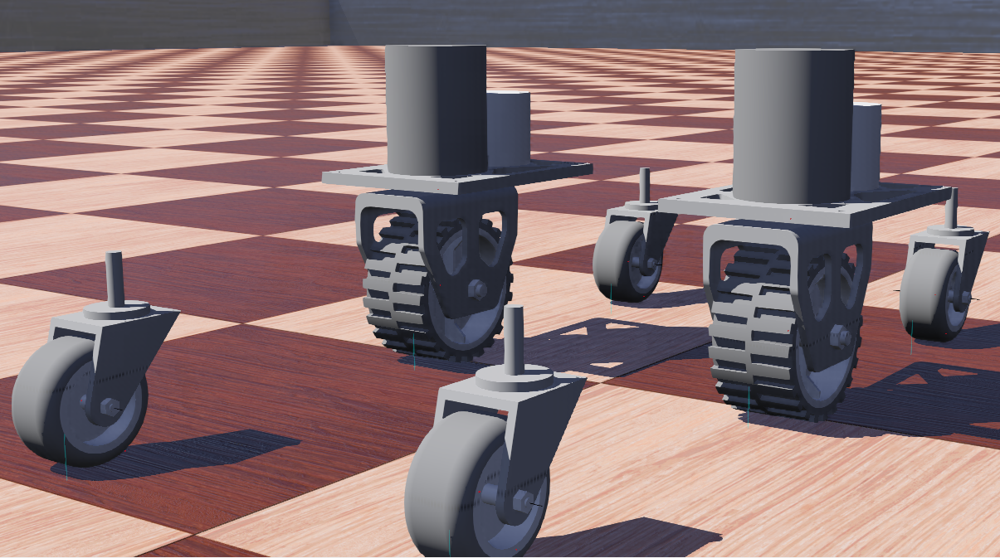

# Swerve

I created these simulations using Webots to learn more about robotics and
autonomous behaviors / controls.

## Usage

```sh
git clone git@github.com:twh2898/swerve.git
cd swerve
make setup
make build
```

Open the world file using Webots `worlds/SwerveWorld.wbt`

## Development

Most of the code is found under `libraries/` where a folder exists for each
component along with the a `CMakeLists.txt` for adding them as build targets.

```plaintext
libraries
├── base/
│   ├── CMakeLists.txt
│   ├── include/
│   └── src/
├── CMakeLists.txt
├── json/
│   ├── CMakeLists.txt
│   └── include/
└── util/
    ├── CMakeLists.txt
    ├── include/
    └── src/
```

This library of components is used in each of the robot controllers found under
`controllers/`

```plaintext
controllers/
├── 2wheel/
│   ├── CMakeLists.txt
│   ├── config.json
│   ├── include/
│   └── src/
├── CMakeLists.txt
└── swerve/
    ├── CMakeLists.txt
    ├── config.json
    ├── include/
    └── src/
```

Currently, only the `swerve` controller is under development along with the
library code.

## Additional Files

Models are located under `models/` including the Collada models and Blender
source files.

Prototypes and additional models are located under `protos/`

```plaintext
protos/
├── caster/
│   ├── Caster.proto
│   ├── model/
│   └── SpringCaster.proto
├── drive/
│   ├── Drive.proto
│   └── model/
├── Roomba.proto
├── Swerve.proto
└── Trackless.proto
```

## Image


